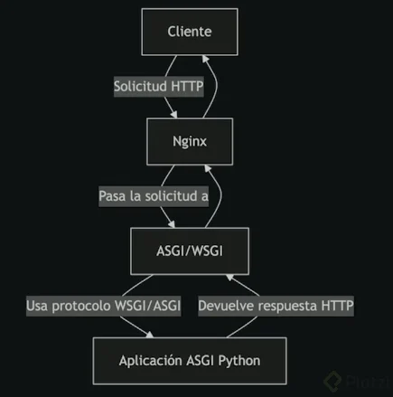

# Curso de Despliegue de Aplicaciones Python en la Nube

Curso de Despliegue de Aplicaciones Python en la Nube
4.9

Publicado el 19 de noviembre de 2024

Nivel Básico
23 clases
3 horas de contenido
10 horas de práctica

Aprende a Desplegar aplicaciones Python. Utiliza WSGI, ASGI, y NGINX. Configura servidores en AWS, Linode, y DigitalOcean. Asegura tus aplicaciones con certificados SSL, optimiza tus bases de datos. Y automatizar procesos con Ansible y CI/CD con GitHub Actions para un entorno productivo eficiente.

Clases del curso

## Fundamentos de Deployment y Control de Versiones

### 1 ¿Cómo Desplegar Aplicaciones Python?

    ¿Cómo Desplegar Aplicaciones Python?
    02:27 minutos

- Recursos
    ¿Cómo las aplicaciones de Python se conectan con los servidores web?

  - El cliente hace solicitud de un página Web al servidor
  - El servidor regresa el archivo que es interpretado por un el Browser
  - Python no retorna un html retorna un output o salida que debe pasar a través de un protocolo que lo convierta en html que se entrega al servidor web que luego lo envía al cliente
  - El protocolo se llama WSGI que proceso un solo proceso
  - El protocolo más moderno se llama ASGI y realiza múltiples procesos con await para proceso asíncronos.
  - Para ejecutar el proyecto se debe instalar:
      · Crear el proyecto
      · Crear el entorno virtual con ``python3 -m venv .venv``
      · Crear el archivo que ejecuta WSGI
      · Instalar gunicorn : ``pip install gunicorn``
      · Ejecutar gunicorn : ``gunicorn –workers 2 –bind 127.0.0.1:8000 wsgi_app:app``

  WSGI vs ASGI

  Para escoger en WSGI vs ASGI se deben tomar en cuenta:
      · Tipo de aplicación
      · Manejo de I/O
      · Framework a utilizar

  Si se utiliza WSGI se debe utilizar : Gunicorn o uWSGI
  Si se utiliza ASGI se debe utilizar : Uvicorn o Daphne

### 2 Introducción a WSGI y ASGI para aplicaciones Python

    Introducción a WSGI y ASGI para aplicaciones Python
    09:35 minutos

- gunicorn --help
    usage: gunicorn [OPTIONS] [APP_MODULE]

    optional arguments:
    -h, --help            show this help message and exit
    -v, --version         show program's version number and exit
    -c CONFIG, --config CONFIG
                            :ref:`The Gunicorn config file<configuration_file>`.
                            [./gunicorn.conf.py]
    -b ADDRESS, --bind ADDRESS
                            The socket to bind. [['127.0.0.1:8000']]
    --backlog INT         The maximum number of pending connections. [2048]
    -w INT, --workers INT
                            The number of worker processes for handling requests.
                            [1]
    -k STRING, --worker-class STRING
                            The type of workers to use. [sync]
    --threads INT         The number of worker threads for handling requests.
                            [1]
    --worker-connections INT
                            The maximum number of simultaneous clients. [1000]
    --max-requests INT    The maximum number of requests a worker will process
                            before restarting. [0]
    --max-requests-jitter INT
                            The maximum jitter to add to the *max_requests*
                            setting. [0]
    -t INT, --timeout INT
                            Workers silent for more than this many seconds are
                            killed and restarted. [30]
    --graceful-timeout INT
                            Timeout for graceful workers restart. [30]
    --keep-alive INT      The number of seconds to wait for requests on a Keep-
                            Alive connection. [2]
    --limit-request-line INT
                            The maximum size of HTTP request line in bytes. [4094]
    --limit-request-fields INT
                            Limit the number of HTTP headers fields in a request.
                            [100]
    --limit-request-field_size INT
                            Limit the allowed size of an HTTP request header
                            field. [8190]
    --reload              Restart workers when code changes. [False]
    --reload-engine STRING
                            The implementation that should be used to power
                            :ref:`reload`. [auto]
    --reload-extra-file FILES
                            Extends :ref:`reload` option to also watch and reload
                            on additional files [[]]
    --spew                Install a trace function that spews every line
                            executed by the server. [False]
    --check-config        Check the configuration and exit. The exit status is 0
                            if the [False]
    --print-config        Print the configuration settings as fully resolved.
                            Implies :ref:`check-config`. [False]
    --preload             Load application code before the worker processes are
                            forked. [False]
    --no-sendfile         Disables the use of ``sendfile()``. [None]
    --reuse-port          Set the ``SO_REUSEPORT`` flag on the listening socket.
                            [False]
    --chdir CHDIR         Change directory to specified directory before loading
                            apps. [/Volumes/2nSSD/018_PLATZI/Curso de Despliegue
                            de Aplicaciones Python en la Nube]
    -D, --daemon          Daemonize the Gunicorn process. [False]
    -e ENV, --env ENV     Set environment variables in the execution
                            environment. [[]]
    -p FILE, --pid FILE   A filename to use for the PID file. [None]
    --worker-tmp-dir DIR  A directory to use for the worker heartbeat temporary
                            file. [None]
    -u USER, --user USER  Switch worker processes to run as this user. [501]
    -g GROUP, --group GROUP
                            Switch worker process to run as this group. [20]
    -m INT, --umask INT   A bit mask for the file mode on files written by
                            Gunicorn. [0]
    --initgroups          If true, set the worker process's group access list
                            with all of the [False]
    --forwarded-allow-ips STRING
                            Front-end's IPs from which allowed to handle set
                            secure headers. [127.0.0.1,::1]
    --access-logfile FILE
                            The Access log file to write to. [None]
    --disable-redirect-access-to-syslog
                            Disable redirect access logs to syslog. [False]
    --access-logformat STRING
                            The access log format. [%(h)s %(l)s %(u)s %(t)s
                            "%(r)s" %(s)s %(b)s "%(f)s" "%(a)s"]
    --error-logfile FILE, --log-file FILE
                            The Error log file to write to. [-]
    --log-level LEVEL     The granularity of Error log outputs. [info]
    --capture-output      Redirect stdout/stderr to specified file in
                            :ref:`errorlog`. [False]
    --logger-class STRING
                            The logger you want to use to log events in Gunicorn.
                            [gunicorn.glogging.Logger]
    --log-config FILE     The log config file to use. [None]
    --log-config-json FILE
                            The log config to read config from a JSON file [None]
    --log-syslog-to SYSLOG_ADDR
                            Address to send syslog messages.
                            [unix:///var/run/syslog]
    --log-syslog          Send *Gunicorn* logs to syslog. [False]
    --log-syslog-prefix SYSLOG_PREFIX
                            Makes Gunicorn use the parameter as program-name in
                            the syslog entries. [None]
    --log-syslog-facility SYSLOG_FACILITY
                            Syslog facility name [user]
    -R, --enable-stdio-inheritance
                            Enable stdio inheritance. [False]
    --statsd-host STATSD_ADDR
                            The address of the StatsD server to log to. [None]
    --dogstatsd-tags DOGSTATSD_TAGS
                            A comma-delimited list of datadog statsd (dogstatsd)
                            tags to append to []
    --statsd-prefix STATSD_PREFIX
                            Prefix to use when emitting statsd metrics (a trailing
                            ``.`` is added, []
    -n STRING, --name STRING
                            A base to use with setproctitle for process naming.
                            [None]
    --pythonpath STRING   A comma-separated list of directories to add to the
                            Python path. [None]
    --paste STRING, --paster STRING
                            Load a PasteDeploy config file. The argument may
                            contain a ``#`` [None]
    --proxy-protocol      Enable detect PROXY protocol (PROXY mode). [False]
    --proxy-allow-from PROXY_ALLOW_IPS
                            Front-end's IPs from which allowed accept proxy
                            requests (comma separated). [127.0.0.1,::1]
    --keyfile FILE        SSL key file [None]
    --certfile FILE       SSL certificate file [None]
    --ssl-version SSL_VERSION
                            SSL version to use (see stdlib ssl module's).
                            [_SSLMethod.PROTOCOL_TLS]
    --cert-reqs CERT_REQS
                            Whether client certificate is required (see stdlib ssl
                            module's) [VerifyMode.CERT_NONE]
    --ca-certs FILE       CA certificates file [None]
    --suppress-ragged-eofs
                            Suppress ragged EOFs (see stdlib ssl module's) [True]
    --do-handshake-on-connect
                            Whether to perform SSL handshake on socket connect
                            (see stdlib ssl module's) [False]
    --ciphers CIPHERS     SSL Cipher suite to use, in the format of an OpenSSL
                            cipher list. [None]
    --paste-global CONF   Set a PasteDeploy global config variable in
                            ``key=value`` form. [[]]
    --permit-obsolete-folding
                            Permit requests employing obsolete HTTP line folding
                            mechanism [False]
    --strip-header-spaces
                            Strip spaces present between the header name and the
                            the ``:``. [False]
    --permit-unconventional-http-method
                            Permit HTTP methods not matching conventions, such as
                            IANA registration guidelines [False]
    --permit-unconventional-http-version
                            Permit HTTP version not matching conventions of 2023
                            [False]
    --casefold-http-method
                            Transform received HTTP methods to uppercase [False]
    --forwarder-headers FORWARDER_HEADERS
                            A list containing upper-case header field names that
                            the front-end proxy [SCRIPT_NAME,PATH_INFO]
    --header-map HEADER_MAP
                            Configure how header field names are mapped into
                            environ [drop]

- uvicorn --help
    Usage: uvicorn [OPTIONS] APP

    Options:
    --host TEXT                     Bind socket to this host.  [default:
                                    127.0.0.1]
    --port INTEGER                  Bind socket to this port.  [default: 8000]
    --uds TEXT                      Bind to a UNIX domain socket.
    --fd INTEGER                    Bind to socket from this file descriptor.
    --reload                        Enable auto-reload.
    --reload-dir PATH               Set reload directories explicitly, instead
                                    of using the current working directory.
    --reload-include TEXT           Set glob patterns to include while watching
                                    for files. Includes '*.py' by default; these
                                    defaults can be overridden with `--reload-
                                    exclude`. This option has no effect unless
                                    watchfiles is installed.
    --reload-exclude TEXT           Set glob patterns to exclude while watching
                                    for files. Includes '.*, .py[cod], .sw.*,
                                    ~*' by default; these defaults can be
                                    overridden with `--reload-include`. This
                                    option has no effect unless watchfiles is
                                    installed.
    --reload-delay FLOAT            Delay between previous and next check if
                                    application needs to be. Defaults to 0.25s.
                                    [default: 0.25]
    --workers INTEGER               Number of worker processes. Defaults to the
                                    $WEB_CONCURRENCY environment variable if
                                    available, or 1. Not valid with --reload.
    --loop [auto|asyncio|uvloop]    Event loop implementation.  [default: auto]
    --http [auto|h11|httptools]     HTTP protocol implementation.  [default:
                                    auto]
    --ws [auto|none|websockets|wsproto]
                                    WebSocket protocol implementation.
                                    [default: auto]
    --ws-max-size INTEGER           WebSocket max size message in bytes
                                    [default: 16777216]
    --ws-ping-interval FLOAT        WebSocket ping interval  [default: 20.0]
    --ws-ping-timeout FLOAT         WebSocket ping timeout  [default: 20.0]
    --ws-per-message-deflate BOOLEAN
                                    WebSocket per-message-deflate compression
                                    [default: True]
    --lifespan [auto|on|off]        Lifespan implementation.  [default: auto]
    --interface [auto|asgi3|asgi2|wsgi]
                                    Select ASGI3, ASGI2, or WSGI as the
                                    application interface.  [default: auto]
    --env-file PATH                 Environment configuration file.
    --log-config PATH               Logging configuration file. Supported
                                    formats: .ini, .json, .yaml.
    --log-level [critical|error|warning|info|debug|trace]
                                    Log level. [default: info]
    --access-log / --no-access-log  Enable/Disable access log.
    --use-colors / --no-use-colors  Enable/Disable colorized logging.
    --proxy-headers / --no-proxy-headers
                                    Enable/Disable X-Forwarded-Proto,
                                    X-Forwarded-For, X-Forwarded-Port to
                                    populate remote address info.
    --server-header / --no-server-header
                                    Enable/Disable default Server header.
    --date-header / --no-date-header
                                    Enable/Disable default Date header.
    --forwarded-allow-ips TEXT      Comma separated list of IPs to trust with
                                    proxy headers. Defaults to the
                                    $FORWARDED_ALLOW_IPS environment variable if
                                    available, or '127.0.0.1'.
    --root-path TEXT                Set the ASGI 'root_path' for applications
                                    submounted below a given URL path.
    --limit-concurrency INTEGER     Maximum number of concurrent connections or
                                    tasks to allow, before issuing HTTP 503
                                    responses.
    --backlog INTEGER               Maximum number of connections to hold in
                                    backlog
    --limit-max-requests INTEGER    Maximum number of requests to service before
                                    terminating the process.
    --timeout-keep-alive INTEGER    Close Keep-Alive connections if no new data
                                    is received within this timeout.  [default:
                                    5]
    --timeout-graceful-shutdown INTEGER
                                    Maximum number of seconds to wait for
                                    graceful shutdown.
    --ssl-keyfile TEXT              SSL key file
    --ssl-certfile TEXT             SSL certificate file
    --ssl-keyfile-password TEXT     SSL keyfile password
    --ssl-version INTEGER           SSL version to use (see stdlib ssl module's)
                                    [default: 17]
    --ssl-cert-reqs INTEGER         Whether client certificate is required (see
                                    stdlib ssl module's)  [default: 0]
    --ssl-ca-certs TEXT             CA certificates file
    --ssl-ciphers TEXT              Ciphers to use (see stdlib ssl module's)
                                    [default: TLSv1]
    --header TEXT                   Specify custom default HTTP response headers
                                    as a Name:Value pair
    --version                       Display the uvicorn version and exit.
    --app-dir TEXT                  Look for APP in the specified directory, by
                                    adding this to the PYTHONPATH. Defaults to
                                    the current working directory.
    --h11-max-incomplete-event-size INTEGER
                                    For h11, the maximum number of bytes to
                                    buffer of an incomplete event.
    --factory                       Treat APP as an application factory, i.e. a
                                    () -> <ASGI app> callable.
    --help                          Show this message and exit.

### 3 Control de versiones en Git y prácticas de versionamiento en Python

    Control de versiones en Git y prácticas de versionamiento en Python
    06:28 minutos

- Utilizamos Git para manejar las versiones del código.

    **Semantic Version**

    MAYOR.MINOR.PATCH
    1.3.5

    Significa que es”
    MAYOR: 1 --> Se debe modificar cuando se cambio mucho lo que ya hay hecho o se agregan nuevas capacidades.
    MINOR: 3 --> Se debe modificar cuando se han hechos cambio para mejorar o para aumentar la capacidad del código existente.
    PATCH: 5 --> Se debe modificar cuando se detecta un error en el código de producción y es necesario corregirlo sin esperar una versión MINOR.

    Para manejas las versiones en Git se utiliza el comando ``git tag -a v1.3.5 -m “Versión corregida”``
    · -a: significa agregar o añadir
    · -m: significa que vamos a enviar un mensaje de la versión

    ``git push origin v1.3.5``

    **Cambios en el código**

    Para manejar los cambio separados de la rama main se necesita crear ramas (``git branch [nombre de la rama]``).

    Para manejar las ramas de forma ordenada se utilizar ``git flow`` se crean cuatro ramas:
    · main --> es la rama a la que se agregan los tags de las versiones
    · develop --> es la rama a la que se le agrega el código de los programadores
    · feature --> como login
    · hotfix --> Reparación de errores o bugs

### 4 Configuración de entornos de desarrollo para despliegue

    Configuración de entornos de desarrollo para despliegue
    07:21 minutos

### 5 Buenas prácticas en el uso de variables de entorno
    Buenas prácticas en el uso de variables de entorno
    05:52 minutos

## Configuración de Servidores en la Nube para Despliegue

### 6 Fundamentos de servidores y conexión por SSH
    Fundamentos de servidores y conexión por SSH
    03:33 minutos

### 7 Creación y configuración de instancias en AWS, Linode y DigitalOcean
    Creación y configuración de instancias en AWS, Linode y DigitalOcean
    07:17 minutos

### 8 Creación de instancias en AWS
    Creación de instancias en AWS
    12:44 minutos

### 9 Configuración de SSH
    Configuración de SSH
    08:41 minutos

10
Instalación y gestión de paquetes en el servidor
Instalación y gestión de paquetes en el servidor
10:13 minutos

11
Configuración de DNS para dominios en despliegue
Configuración de DNS para dominios en despliegue
13:55 minutos

12
Certificados SSL con Let’s Encrypt para seguridad en producción

    Certificados SSL con Let’s Encrypt para seguridad en producción
    05:16 minutos

Administración y Optimización de Servidores para Producción

    13
    Configuración de servidores web y aplicaciones con WSGI y ASGI

Configuración de servidores web y aplicaciones con WSGI y ASGI
14:41 minutos

14
¿Cómo configurar UWSGI con Python y NginX en producción?
¿Cómo configurar UWSGI con Python y NginX en producción?
14:34 minutos

15
Configuración de Proxy Reverso en Nginx para Aplicaciones WSGI
Configuración de Proxy Reverso en Nginx para Aplicaciones WSGI
04:33 minutos

16
Manejo de errores y configuración de logs en producción
Manejo de errores y configuración de logs en producción
11:49 minutos

17
Monitoreo de aplicaciones Python en producción usando Sentry
Monitoreo de aplicaciones Python en producción usando Sentry
08:54 minutos

18
¿Cómo configurar un archivo .env en Django para producción?

    ¿Cómo configurar un archivo .env en Django para producción?
    04:28 minutos

Integración de Servicios Complementarios para Aplicaciones Python

    19
    Configuración de Bases de Datos PostgreSQL en el Servidor de la Aplicación

Configuración de Bases de Datos PostgreSQL en el Servidor de la Aplicación
08:20 minutos

20
Configuración de Bases de Datos en Producción con Amazon RDS
Configuración de Bases de Datos en Producción con Amazon RDS
11:47 minutos

21
Servicios para archivos estáticos (S3, Cloudflare)

    Servicios para archivos estáticos (S3, Cloudflare)
    06:05 minutos

Automatización y CI/CD para Despliegues Python

    22
    Automatización de despliegue con Ansible

Automatización de despliegue con Ansible
11:39 minutos
